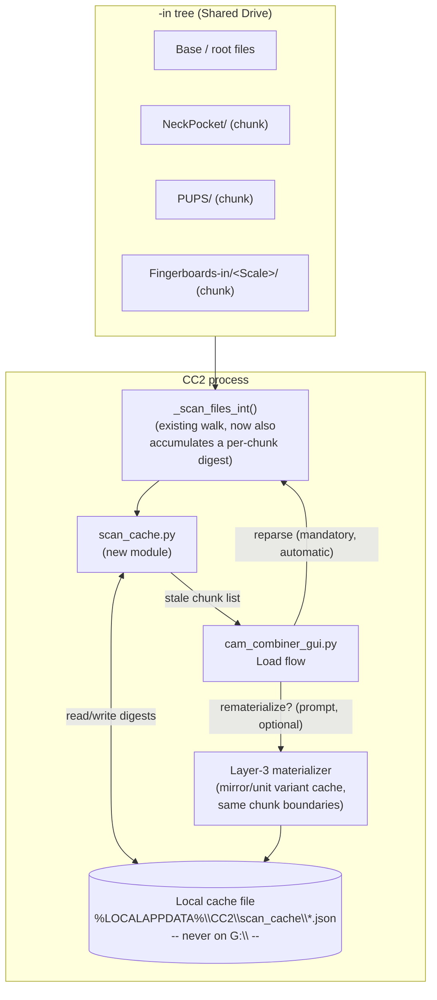
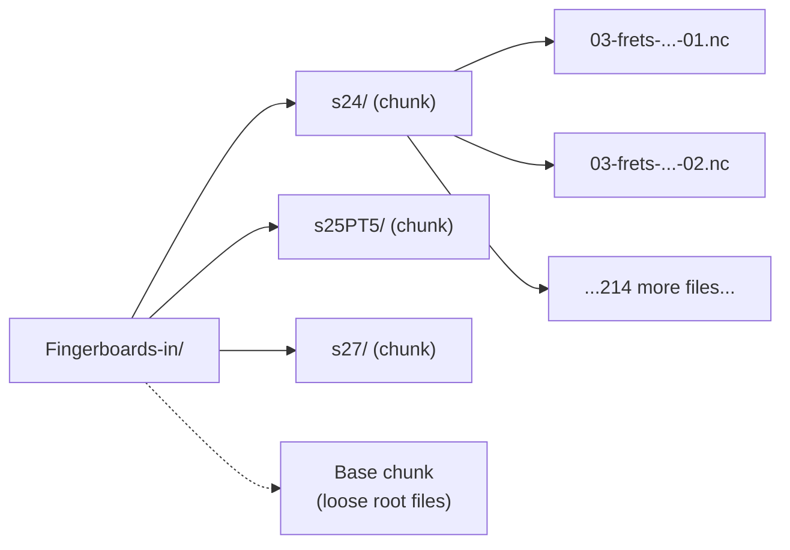
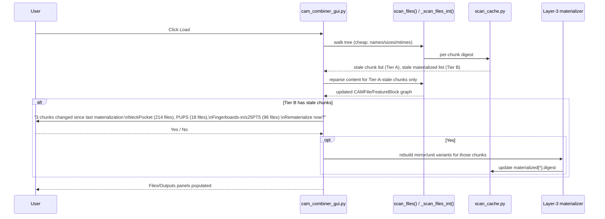

# Chunked Scan Cache + Combination Materialization — Design

Status: **proposal, not yet implemented.** Written up from a brainstorming
session on handling `-in` directories that grow into the thousands of files
(ParamBuilder-generated fingerboard/neck/body corpora). Nothing in this doc
is built yet — treat it as the spec to review before writing code.

## 1. Problem

Two independent costs in the current pipeline scale with the size of a
`-in` tree, and both currently redo full work on every run even when
nothing changed:

1. **Content parsing on every Load.** `scan_files()` →
   `_scan_files_int()` (`cam_core/planner.py:158,190`) walks the whole tree
   and constructs a `CAMFile` per file. `CAMFile.__init__`
   (`cam_core/cam_file.py:123`) opens and regex-scans each file's full
   content (tool, MOP header, X/Y/Z/F/S) — every file, every Load, even if
   only one feature's worth of files changed since the last Load.
2. **The mirror/unit-replication transform on every combine.**
   `write_output_file()` (`cam_core/writer.py:4`) calls
   `CAMFile.get_output()` (`cam_core/cam_file.py:363`), which for every
   output unit re-walks every line of the file and, when mirrored,
   regex-matches and recomputes the X coordinate
   (`_int_mirror_line`, `cam_core/cam_file.py:412`). The inputs to that
   transform (`lefty`, `cline`, `clinedelta`, `direction`, `num_units`) come
   from the physical fixture/panel layout, not from per-file content — a
   small, closed space, not one that grows with the file corpus.

Neither cost is a live/interactive problem today (both are triggered by
Load/Generate button clicks, not per-keystroke — confirmed via the call
sites in `cam_combiner_gui.py:1082,1101,1138,426,479`). But as corpora grow
into the thousands, both add real, avoidable wall-clock time to routine
operations, and eliminating them removes the need to hand-special-case
"large tree" behavior anywhere else in the app.

## 2. Goals / non-goals

**Goals**
- Skip re-parsing file content for any part of the tree that hasn't
  changed since it was last scanned.
- Make that skip granular enough to match how updates actually happen
  (a whole feature's worth of files regenerated at once — e.g. "all neck
  profile operations" — not single-file edits), so a targeted regen only
  invalidates the part of the cache it actually touched.
- Give the user visibility and a decision point before spending the
  (potentially larger) cost of rematerializing precomputed mirror/unit
  variants — never do that silently.
- Keep correctness independent of the chunking assumption: if an edit ever
  straddles multiple chunks unexpectedly, the worst outcome is "more chunks
  flagged stale," never a wrong scan.

**Non-goals (v1)**
- No incremental per-file diffing *within* a stale chunk — a stale chunk
  gets fully reparsed/rematerialized. Simplicity over marginal speed.
- No cross-repo coordination with ParamBuilder (a shared version stamp,
  a generator-emitted manifest) — this design only checksums bytes already
  on disk, so it works regardless of what produced them. That question
  stays open/separate (see `cc2-integration-conventions` in ParamBuilder's
  memory) and can layer on top later without changing this design.
- No attempt to implement true cut-direction reversal (path-order reversal,
  as distinct from the coordinate-flip + G2/G3-swap `get_output()` already
  does — see §10). Confirmed with the user: operations where cut direction
  actually matters continue to be manually generated as separate lefty/
  righty files outside CC2, unchanged. Tier B's job is strictly to cache
  whatever `get_output()` already produces today, never to extend or
  "correct" that transform.

## 3. Architecture overview



Key point: the digest computation rides on the directory walk
`_scan_files_int()` already performs (`os.scandir` already yields
name/size/mtime per entry) — detecting staleness costs essentially nothing
beyond what happens today. What gets *skipped* on a cache hit is the
expensive part: opening and regex-parsing each file's content.

## 4. Chunk = FeatureBlock

No new grouping concept is needed. `_scan_files_int` already creates one
`FeatureBlock` per subdirectory (`cam_core/planner.py:223-231`,
`cam_core/FeatureBlock.py`) and files directly under the base/shared root
already collapse into the single `"Base"` block. A chunk is just:

> the set of files directly inside one `FeatureBlock`.

A `<Scale>`-subdirectory convention (or any other directory-per-group
convention) falls out for free: any directory that directly contains files
becomes its own chunk, at whatever nesting depth it lives.



## 5. Digest computation

For each `FeatureBlock`, accumulate `(name, size, mtime_ns)` for every file
added to it during the walk (the data is already in hand at
`cam_core/planner.py:197-203`, no extra stat calls). At the end of the
walk, sort that list and hash it:

```python
def chunk_digest(entries: list[tuple[str, int, int]]) -> str:
    # entries: (filename, size, mtime_ns), already sorted by filename
    h = hashlib.sha256()
    for name, size, mtime_ns in sorted(entries):
        h.update(f"{name}|{size}|{mtime_ns}\n".encode("utf-8"))
    return h.hexdigest()
```

Sorting by name (not insertion order) and hashing size+mtime together
means additions, removals, and content-changes-that-bump-mtime are all
caught — not just count changes.

## 6. Cache file — local only, never on the synced tree

ParamBuilder's own memory documents a real hang caused by writing
frequently-rewritten small files onto the Drive-synced `G:\` path during
its profiling batch (fixed by staging locally, batch-copying at the end).
This cache must not repeat that: it's a pure local performance cache, not
shared state, so it has no reason to live on the synced tree at all.

Location: `%LOCALAPPDATA%\CC2\scan_cache\<sha1 of abspath(base_dir)>.json`

Write pattern: atomic replace (temp file + `os.replace`) — the same
pattern already proven in ParamBuilder's `Checkpoint` class. Cache loss/
corruption is never a correctness risk, only a speed one (falls back to a
full reparse, identical to today's behavior).

```json
{
  "base_dir": "G:\\Shared drives\\...\\Fingerboards-in",
  "shared_dir": "G:\\Shared drives\\...\\SharedGCode",
  "chunks": {
    "Base": {
      "digest": "sha256:9f2a...",
      "file_count": 12,
      "last_scanned": "2026-08-04T12:03:11Z"
    },
    "NeckPocket": {
      "digest": "sha256:7cb1...",
      "file_count": 214,
      "last_scanned": "2026-08-04T12:03:11Z"
    }
  },
  "materialized": {
    "NeckPocket": {
      "digest": "sha256:7cb1...",
      "variant_count": 428,
      "last_materialized": "2026-08-03T19:40:02Z"
    }
  }
}
```

`chunks[*].digest` tracks Tier A (raw scan). `materialized[*].digest`
tracks Tier B (mirror/unit precompute) *separately*, because they can go
stale independently — a chunk can be freshly reparsed but not yet
rematerialized. Comparing `materialized[name].digest` against the current
`chunks[name].digest` is exactly how staleness for Tier B is detected.

## 7. Two-tier Load flow

This is the piece that resolves an ambiguity in the earlier discussion:
reparsing changed content can't be optional (the in-memory model would
just be wrong), but rebuilding the mirror/unit variant cache can be
deferred — that's the tier worth asking the user about.

- **Tier A — mandatory, automatic, cheap:** any chunk whose digest differs
  from the cache gets its files' content reparsed (same
  `CAMFile.__init__` work as today, just scoped to stale chunks instead of
  the whole tree). This always happens, silently, same as a normal Load
  today — it's just faster when most chunks are unchanged.
- **Tier B — optional, user-confirmed, potentially heavier:** rebuilding
  the materialized mirror/unit-variant cache for any chunk whose
  `materialized` digest lags its current `chunks` digest. Surfaced as a
  prompt, not run automatically.



This also matches the existing house style for this exact kind of
decision point — `scripts/rhinocam_export_selected_mops.py` already prompts
loudly (`rs.MessageBox`) rather than silently guessing when it hits a case
it can't safely automate. The Tier B prompt is the same pattern applied
here.

## 8. Where this hooks into existing code

| Piece | File | Change |
|---|---|---|
| Digest accumulation | `cam_core/planner.py` `_scan_files_int()` | Track `(name, size, mtime_ns)` per `FeatureBlock` alongside existing file processing; compute digest per block at the end of `scan_files()`. |
| Cache load/compare/save | new `cam_core/scan_cache.py` | `load_cache(base_dir)`, `stale_chunks(cache, current_digests)`, `save_cache(base_dir, cache)` (atomic write). |
| Skip reparse on hit | `cam_core/planner.py` `scan_files()` | Accept an optional cache; for chunks with a matching digest, skip constructing new `CAMFile`s from disk (reuse whatever the caller already has from the previous Load — see open question in §10 about in-memory reuse across Loads vs. only cross-process). |
| Tier B staleness + prompt | `cam_combiner_gui.py` (Load handlers, lines ~1082/1101/1138) | After scan, compare `materialized` digests; show prompt if any lag. |
| Materializer | new module, e.g. `cam_core/materialize.py` | For a given chunk: enumerate the closed `(lefty, cline, clinedelta, direction, num_units)` space actually used by real job configs, precompute `get_output()` per combination, cache alongside the chunk. |
| `get_output()` fast path | `cam_core/cam_file.py:363` | If a precomputed variant exists for the requested combination, return it directly instead of recomputing `_int_mirror_line` per line. |

## 9. Edge cases

- **New chunk (new subdirectory):** absent from cache → 100% stale,
  treated as first-ever scan for that chunk. No special-casing needed.
- **Removed/renamed chunk:** looks like "one chunk gone, one chunk new" —
  correct outcome (reprocess the new name), slightly wasteful (loses the
  old chunk's cache) but not wrong.
- **Edit spans multiple chunks unexpectedly:** more chunks flagged stale,
  more Tier A reparse work, possibly a bigger Tier B prompt — never
  incorrect, since the digest is the ground truth, not an assumption about
  how edits are grouped.
- **Cache file missing/corrupt:** treat as "everything stale" — identical
  to today's from-scratch scan, just without the speedup. No new failure
  mode introduced.

## 10. Evidence from real corpora

Checked the actual trees under `Alloy-Standard-Builds-CAM` (not just
`Fingerboards-in`) before finalizing this. Findings that confirm or adjust
the design above:

- **The `<Scale>` subfolder convention already exists in production**, not
  just as a proposal: `Fingerboards-in/ScriptOutput/Profiles/` has real
  `s21/`, `s22/`, `s23/`, `s24/`, `s34/`, `A1/` subdirectories (~240 files
  each). §4's "chunk = any directory that directly contains files" maps
  onto this exactly as designed.
- **Necks are confirmed pre-migration, not hypothetical-future:**
  `neck-in` (224 files), `tiltback-necks-in` (152), `ThroughNeck-in` (147),
  `bass-neck-in` (91) are all still flat/loose, no `ScriptOutput/`-style
  folder, 1-2 orders of magnitude smaller than Fingerboards' 1953. This
  design should hold up unchanged when they migrate, but there's nothing to
  validate chunk sizing against for necks specifically yet.
- **Chunks fill in unevenly over time, not atomically** — real evidence,
  not just a theoretical edge case: `Profiles/s34/` has only 40 files
  (scale 34 needs a different fret-kerf mask per ParamBuilder's own
  history) and `Profiles/s27/` currently has zero. §9's "new/partial chunk
  is just 100% stale, no special-casing" already covers this correctly.
- **A live duplicate-hygiene bug, found incidentally:** all 240 files
  directly loose under `Profiles/` are byte-for-byte-same-named as the 240
  under `Profiles/s24/` — leftover from before the scale-subfolder
  convention was introduced, apparently never cleaned up. Worth a separate
  cleanup pass independent of this design, but also confirms §9's "mixed
  migration state" scenario is real, not hypothetical: adopting a
  partitioning convention for an *already-populated* flat corpus needs an
  explicit migrate-and-remove-the-old-copies step, or duplicates like this
  persist silently (and would already be double-counted by CC2's existing
  scan/consistency logic today, regardless of this cache design).
- **Tier B's payoff is per-corpus, not global — this changes §7/§11#1.**
  Handedness is not uniformly a runtime-mirror concern: `neck-in` (33
  files), `ThroughNeck-in` (12), and `t-in` (7) already bake `-lefty-`/
  `-righty-` into literal, separately-generated filenames — no runtime
  mirroring ever happens for those. `Fingerboards-in`, `s-in`,
  `tiltback-necks-in`, and `bass-neck-in` have zero such filenames, meaning
  they rely entirely on CC2's runtime `_int_mirror_line` transform. So
  Tier B materialization is worth building for the corpora that actually
  invoke runtime mirroring, and is a no-op for corpora that pre-bake
  handedness as files — the survey in open question #1 below needs to be
  done **per corpus**, not once globally, and the materializer should be
  something a corpus opts into, not something assumed universal.
  - **Confirmed with the user why the split exists:** `get_output()`'s
    runtime transform is coordinate-flip + G2/G3 arc-winding swap only
    (`cam_file.py:412-460`) — it never reverses the line/path traversal
    order, so it can't produce a true cut-direction (climb vs. conventional
    milling) reversal, only a geometric mirror. That's fine and by design:
    operations where cut direction actually matters are — and will
    continue to be — manually generated as separate lefty/righty files
    outside CC2 (matching the `neck-in`/`ThroughNeck-in`/`t-in` evidence
    above). No change planned to that workflow. This means Tier B has a
    firm, narrow scope: cache exactly what `get_output()` already computes
    for the corpora that use it, never attempt path-order reversal or
    otherwise extend the transform.
- **A combinatorial axis not present in Fingerboards:** neck filenames
  carry a `bt1`/`bt2`/`bt3`/`bt4` (body/blank-thickness) token throughout
  (e.g. `01-standard-blank-locator-pins-AnyScale-bt2-01.nc`). If/when necks
  adopt scripted mass-generation, the natural chunk boundary is likely
  `<Scale>/<bt>`, not `<Scale>` alone. No design change needed — §4's
  chunk-per-directory-with-files already supports arbitrary nesting depth —
  just noted here so it's not a surprise when necks actually migrate.

## 11. Prerequisite: `ROOT-PASSTHROUGH-DIRS` (root/feature classification vs. directory depth)

**Status: implemented** (`cam_core/planner.py`, `cam_core/jsonc_loader.py`,
`cam_combiner_cli.py`, `cam_combiner_gui.py`; tests in
`tests/test_root_passthrough.py`; documented in `docs/GUIDE.md` §6.6).
Landed ahead of the Tier A/B caching work below on the reasoning that it's
small, self-contained, and unblocks pointing CC2 at a real
`ScriptOutput/`-style tree sooner — which in turn gives real usage data for
§12's open questions (chunk sizes, whether Tier B is worth building for a
given corpus) before committing to the caching design itself.

This was a matching-semantics gap this design exposed, not something the
caching design itself introduces — but it blocked the caching design from
being useful on `ScriptOutput/`-style trees until fixed, so it's
documented here as a prerequisite.

**The gap.** `Fingerboards-in/fixture_config.json5:164` declares
`05-profile-<Scale>-<NutWidth>-<NutSlot>-<HeelShape>-<NumFrets>` as an
`INPUT-FILE-NAME-BASES` entry — these files are meant to be matched as
base/root files. But the real files now live nested three levels deep
(`ScriptOutput/Profiles/s24/05-profile-...-01.nc`), and today's code ties
root/feature classification 1:1 to physical top-level placement:
`is_root` (`cam_file.py:37`) is set from
`scan_files.current_featureblock.name == "Base"`
(`planner.py:201`), which is only ever true for files directly in
`base_dir`'s (or `shared_dir`'s) own root — any subdirectory, at any
depth, permanently flips a file onto the *feature* code path instead
(different step-prefix rule, `-front`/`-back`-first instead of
leading-prefix-first, per `cam_file.py:63-79`; grouped into
`CAMFeature`/GUI-checkbox territory instead of matched against
`INPUT-FILE-NAME-BASES`). So as things stand, `ScriptOutput/Profiles/s24/`
files would not be picked up as the base files `fixture_config.json5` says
they are — consistent with ParamBuilder's own memory calling this
integration "proposed, not confirmed."

**This is orthogonal to chunking, and doesn't force any structure of its
own.** §4-6's chunk-per-directory-with-files model already works at any
depth, 0 subdirectories or many, regardless of whether a file ends up
classified as root or feature — that classification only decides which
*matching* code path a file's content feeds into after scanning, not how
staleness is partitioned. Nothing about the caching design requires
`ScriptOutput/`, or any particular nesting shape.

**The fix can't be "any subdirectory is root," though** — real corpora
depend on the opposite today. `PUPs/`, `Bridges/`, `Controls/`,
`Contours/`, etc. across every existing `-in` tree are genuinely optional
*feature* subfolders, auto-grouped into GUI checkboxes on purpose.
Flattening that default would break every tree that isn't using the
ParamBuilder mass-generation pattern.

**Proposed: an explicit opt-in, not a new default.** A `fixture_config.json5`
key, e.g.:

```jsonc
"ROOT-PASSTHROUGH-DIRS": ["ScriptOutput"],
```

— a list of directory paths, relative to `base_dir` (or `shared_dir`).
Any file physically located under a declared passthrough path, at any
depth beneath it, is treated as `is_root = True` (root/base-file matching
rules, including step-prefix parsing) instead of being routed into
`CAMFeature` grouping. Everything not under a declared passthrough path
keeps exactly today's behavior — this is additive, not a behavior change
for any existing corpus unless its `fixture_config.json5` opts in.

**Where it hooks in:** `_scan_files_int()` (`planner.py:190-233`) needs to
check, when recursing into a subdirectory, whether it (or an ancestor)
is a declared passthrough path; if so, keep treating files under it as
belonging to the `"Base"` block (`is_root=True`) instead of creating a new
`FeatureBlock` and flipping `is_root` to `False`. `cam_file.py`'s existing
`is_root`-branching step-prefix logic (`cam_file.py:63-79`) needs no
change — it already does the right thing once `is_root` is set correctly.

**Open sub-question:** match by relative *path* (`"ScriptOutput"`,
`"ScriptOutput/Radius"`, etc.) rather than by bare directory *name* — a
name-only match (e.g. any directory called `Radius` anywhere) risks false
positives if that name is reused elsewhere for an actual feature folder.
Path-prefix matching relative to `base_dir`/`shared_dir` is unambiguous
and should be the default assumption unless there's a reason to want
name-based matching instead.

## 12. Tier A implementation (done)

Status: **implemented** (`cam_core/scan_cache.py`, `cam_core/cam_file.py`,
`cam_core/planner.py`; tests in `tests/test_scan_cache.py`). Two things
changed from §4-8's original sketch, both discovered while actually
building it:

- **Per-file cache, not per-chunk digest.** A plain `(path, size,
  mtime_ns)` check per file turned out simpler to implement than a
  rolled-up `FeatureBlock`-level digest, and it's strictly finer-grained
  (catches a single-file edit inside an otherwise-unchanged directory at no
  extra bookkeeping cost). The chunk/`FeatureBlock` concept from §4 remains
  the right unit for Tier B's UX (batching the "rematerialize?" prompt,
  human-readable status lines) but Tier A's actual invalidation mechanism
  doesn't need it. This also directly answers the standing concern about
  directory restructuring (subdirectories/nesting changing shape): a
  moved/renamed file is just "a path not in the cache" — no chunk-boundary
  bookkeeping to get right, a rescan of the affected files is triggered
  automatically with no special-casing.
- **Persisted content-derived fields, not just a staleness signal.** A
  digest alone only tells you WHETHER something changed, not skips the
  reparse cost — reconstructing a `CAMFile` still needs its tool/
  coordinate/feed-rate/MOP-name fields from somewhere. The cache stores
  those fields directly (`CAMFile.to_cache_fields()` /
  `_restore_cached_fields()`), and `CAMFile` gained lazy raw-content
  loading (`_ensure_content_loaded()`, called from `create_unit_code()`)
  since the raw G-code lines are only actually needed at Generate-Output
  time, never during Load/scan/matching/display. This resolves open
  question #2 below: the disk cache is genuinely required, not just a
  same-session nicety — `scan_files()` always rebuilds its in-memory lists
  from scratch on every call (`scan_files.cfiles = []` at the top of every
  invocation), confirmed unchanged.

**Measured against the real `Fingerboards-in` tree** (4150 files, via
`ROOT-PASSTHROUGH-DIRS`'s `ScriptOutput/` — same config file already
points at both): cold scan ~21s (unchanged from before this work — the
first Load after a real change still has to actually read everything),
warm scan ~0.4s, confirmed stable across 4 consecutive scans, not just two.
That last check mattered: the first implementation only re-recorded cache
*misses* into the fresh per-scan cache dict, so a hit's own entry silently
evaporated after being used once — the cache would go warm, then cold
again on the third Load. Caught by
`tests/test_scan_cache.py::test_cache_hit_survives_across_more_than_two_scans`
before it shipped.

**Verified correct, not just fast:** the full test suite — including
`test_output_matches_golden`'s byte-for-byte G-code comparison — passes
identically before and after this change (same 194 passed / 7 skipped / 13
pre-existing `*-fail-*` failures), and
`test_cache_hit_file_still_produces_correct_output_on_generate` confirms a
cache-hit-constructed file's lazily-loaded output matches a freshly-parsed
file's output exactly.

**No tree insertion**, per the standing constraint: cache lives only in
`%LOCALAPPDATA%\CC2\scan_cache\`, confirmed with no writes to `G:\` at any
point during real-tree testing — the "make a copy before testing" caution
that applies to writing metadata *into* a tree doesn't apply here since
nothing is written there.

## 13. Open questions before implementation

1. **Is `(cline, clinedelta, direction, num_units)` actually bounded**
   *within each corpus that uses runtime mirroring* (tied to one
   spoilboard/tooling layout), or does it vary more per customer/job than
   assumed? Scope this per corpus (per §10's finding that Tier B isn't
   universal) — check `Fingerboards-in`, `s-in`, `tiltback-necks-in`, and
   `bass-neck-in` (the corpora with zero pre-baked lefty/righty filenames)
   first, since those are the ones where Tier B actually applies.
2. ~~In-memory reuse across Loads within one GUI session vs. the disk cache
   only helping across separate process launches~~ — **resolved by §12**:
   `scan_files()` always rebuilds from scratch, so the disk cache is the
   thing providing the win in both cases, confirmed via the 4-consecutive-
   scan measurement above.
3. **Where exactly the Tier B prompt fits in the GUI flow** (modal blocking
   Load, or a non-blocking banner/status the user can act on later) —
   depends on how disruptive a mid-session prompt is to existing workflows.

## 14. Suggested rollout order

1. ~~Implement `ROOT-PASSTHROUGH-DIRS` (§11)~~ — **done**, landed first
   since it's small/self-contained and unblocks pointing CC2 at a real
   `ScriptOutput/`-style tree, which fed real data into step 2.
2. ~~`scan_cache.py` + skip-reparse on hit (§12)~~ — **done**. Applies
   uniformly to every corpus (neck-family included) regardless of Tier B.
3. ~~Wire the stale-chunk list into the GUI as a status line~~ —
   **superseded**: validated directly via `tests/test_scan_cache.py` plus
   real-tree timing instead of a GUI change; Tier A is designed to be
   silent/automatic (§7), so no status line is actually needed for it.
4. Clean up the `Fingerboards-in/ScriptOutput/Profiles/` loose-vs-`s24/`
   duplicate (§10) — unrelated to this design mechanically, but doing it
   now avoids the cache ever having to reason about it.
5. Answer open question #1 **per corpus that actually uses runtime
   mirroring** (`Fingerboards-in`, `s-in`, `tiltback-necks-in`,
   `bass-neck-in` first).
6. Build the Tier B materializer + prompt, opt-in per corpus, scoped to
   whatever #5 finds.
